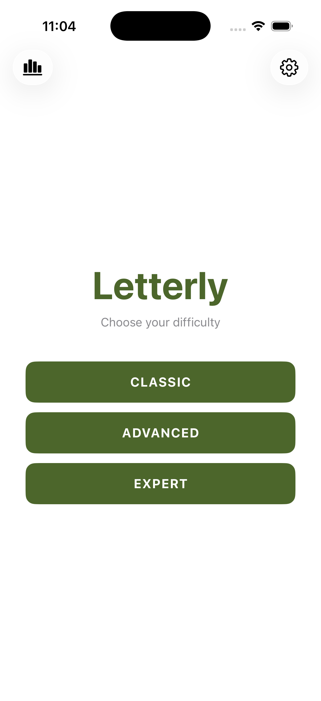
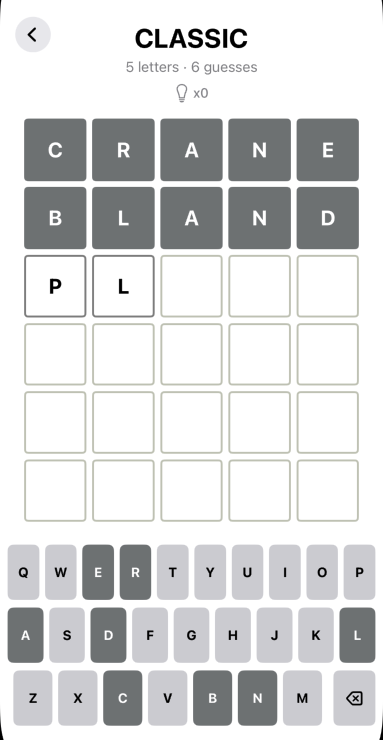
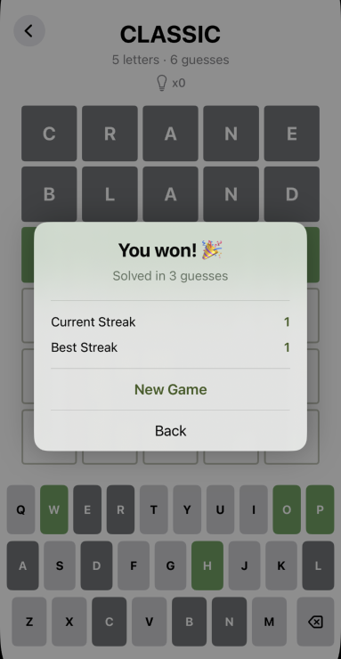
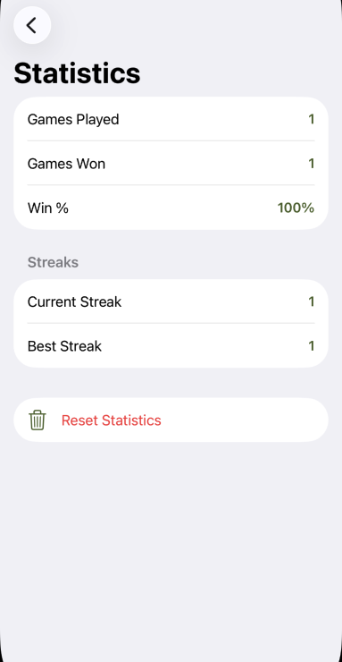
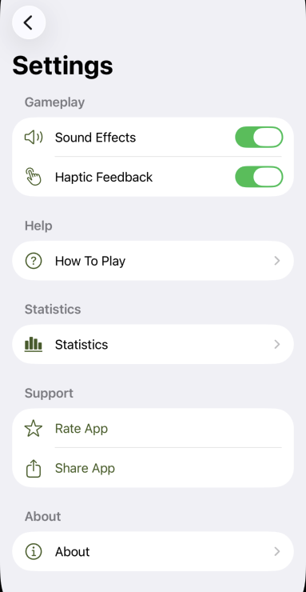
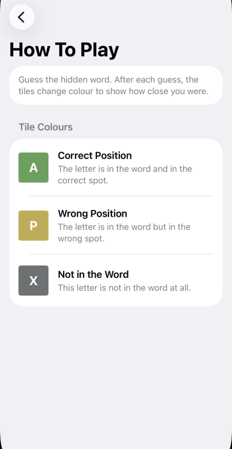
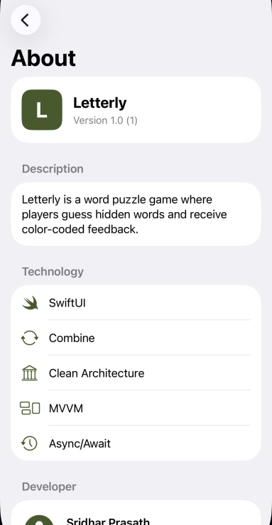

# Letterly

**Letterly** is a SwiftUI word puzzle game inspired by Wordle. Players guess a hidden word within a limited number of attempts; each guess returns colour-coded tile feedback. Three difficulty modes, AI-powered hints, full statistics tracking, and game-state persistence across sessions.

---

## Screenshots

| Start | Game | End of Game | Statistics |
|---|---|---|---|
|  |  |  |  |

| Settings | How To Play | About |
|---|---|---|
|  |  |  |

---

## Features

**Gameplay**
- Three difficulty modes — Classic (5 letters), Advanced (6 letters), Expert (7 letters)
- Colour-coded tile feedback after every guess
- Dynamic on-screen keyboard that colours each key as letters are confirmed or eliminated
- Dictionary validation across 9,626 words
- Duplicate guess detection

**AI Hints**
- AI-powered hints generated by Groq (Llama 3.1 8B Instant), proxied securely through a Cloudflare Worker
- Hints are distinct — the model receives all prior hints and avoids repeating them
- Hint history — tap the bulb icon at any time to review all hints received in the current game
- Per-mode hint limits: 1 (Classic), 2 (Advanced), 3 (Expert)

**Persistence & Session Management**
- In-progress games are saved automatically after every guess
- Resume or start fresh — tapping a mode with a saved game prompts a choice; no progress is lost silently
- End-game summary overlay shows result, guesses used, and live streak stats with New Game / Back options

**Statistics**
- Global statistics: games played, games won, win percentage, current streak, best streak
- Streaks update immediately at the end of each game
- Reset statistics with a destructive confirmation dialog

**Settings**
- Sound effects toggle
- Haptic feedback toggle
- Quick links to Statistics, How To Play, Rate App, and Share App

**Help & About**
- How To Play screen with colour-coded tile examples
- About screen with version info, developer details, privacy policy, and terms of service

**Platform**
- Dark and light mode
- No external Swift dependencies (no SPM packages, no CocoaPods)

---

## Architecture

Letterly follows **Clean Architecture + MVVM**. Dependency arrows always point inward — Presentation depends on Domain, Data depends on Domain, Domain depends on nothing.

```
┌──────────────────────────────────┐
│         Presentation             │
│  StartView  GameView  StatsView  │
│  SettingsView  HowToPlayView     │
│  AboutView  EndGameView          │
│         GameViewModel            │
│         StatsViewModel           │
└────────────┬─────────────────────┘
             │ uses protocols from
┌────────────▼─────────────────────┐
│             Domain               │
│   Models  Repositories  UseCases │
└────────────▲─────────────────────┘
             │ implements protocols
┌────────────┴─────────────────────┐
│              Data                │
│  WordStore  HintAPIService       │
│  WordRepositoryImpl              │
│  HintRepositoryImpl              │
│  GameStateRepositoryImpl         │
│  StatsRepositoryImpl             │
└──────────────────────────────────┘
```

### Domain Models

| Type | Kind | Purpose |
|---|---|---|
| `Word` | struct | Dictionary word with optional last-answered timestamp |
| `LetterTile` | struct | Single board cell — holds `Character?` and `LetterState` |
| `LetterState` | enum | `.empty` / `.correct` / `.present` / `.absent` — drives tile and keyboard colours |
| `GameMode` | enum | `.classic` / `.advanced` / `.expert` — encapsulates word length, max guesses, max hints |
| `GameStatus` | enum | `.win` / `.lose` / `.continueGame` |
| `GuessResult` | struct | Output of `EvaluateGuessUseCase` — guess string + per-letter states |
| `GameSaveState` | struct | Serialisable snapshot of an in-progress game board |
| `GameStats` | struct | Global statistics counters |

### Repository Protocols

```swift
protocol WordRepository {
    func getRandomWord(length: Int) async -> Word?
    func getWord(value: String) async -> Word?
    func updateWord(_ word: Word) async
    func exists(_ value: String) async -> Bool
}

protocol HintRepository {
    func getHint(word: String, previousHints: [String]) async -> Result<String, Error>
}

protocol GameStateRepository {
    func save(_ state: GameSaveState, mode: GameMode)
    func load(mode: GameMode) -> GameSaveState?
    func clear(mode: GameMode)
}

protocol StatsRepository {
    func load() -> GameStats
    func save(_ stats: GameStats)
    func reset()
}
```

### Use Cases

Each use case is a pure value-type struct with a single `execute()` method.

| Use Case | Purpose |
|---|---|
| `GetRandomWordUseCase` | Picks a word not answered in the last 10 days (10 retries) |
| `CheckWordExistsUseCase` | Validates a guess against the dictionary |
| `EvaluateGuessUseCase` | Two-pass Wordle algorithm — correct positions first, then present |
| `ApplyGuessResultUseCase` | Returns a new board with tile states applied to the given row |
| `CheckGameStatusUseCase` | Returns `.win`, `.lose`, or `.continueGame` |
| `CheckDuplicateGuessUseCase` | Case-insensitive check against prior guesses |
| `ClearRowUseCase` | Resets all tiles in a row to `.empty` |
| `UpdateKeyboardStateUseCase` | Applies colour precedence: correct > present > absent |
| `UpdateWordTimestampUseCase` | Persists the current date as last-answered for the target word |
| `GetHintUseCase` | Passes through to `HintRepository` |
| `SaveGameStateUseCase` | Serialises and persists the current board after each guess |
| `LoadGameStateUseCase` | Restores a saved board on mode selection |
| `ClearGameStateUseCase` | Removes saved state for a mode on game completion or explicit reset |
| `GetStatsUseCase` | Loads the global statistics record |
| `RecordGameResultUseCase` | Updates win/loss counters and streaks after a game ends |
| `ResetStatsUseCase` | Zeroes all statistics counters |

---

## AI Hint Architecture

```
Letterly (iOS)
      │
      │  URLSession POST /hint
      ▼
Letterly Worker (Cloudflare)
      │
      │  Injects GROQ_API_KEY from Cloudflare secret store
      ▼
Groq API  (llama-3.1-8b-instant)
```

**Why the Worker exists:** Embedding an API key in an iOS binary is insecure — the key is extractable from any IPA file. By routing hint requests through the Cloudflare Worker:

- The iOS app holds only the Worker's public HTTPS URL — never a credential.
- The Groq API key is stored as a Cloudflare Worker secret, inaccessible to any client.
- Rate-limiting, request validation, or key rotation can be applied server-side without shipping an app update.

The Worker URL is injected into the app via `Configuration/Secrets.xcconfig` at build time and never committed to source control.

---

## Project Structure

```
Letterly/
├── Domain/
│   ├── Model/
│   │   ├── Word.swift
│   │   ├── LetterTile.swift
│   │   ├── LetterState.swift
│   │   ├── GameMode.swift
│   │   ├── GameStatus.swift
│   │   ├── GuessResult.swift
│   │   ├── GameSaveState.swift
│   │   └── GameStats.swift
│   ├── Repository/
│   │   ├── WordRepository.swift
│   │   ├── HintRepository.swift
│   │   ├── GameStateRepository.swift
│   │   └── StatsRepository.swift
│   └── UseCase/
│       ├── GetRandomWordUseCase.swift
│       ├── CheckWordExistsUseCase.swift
│       ├── EvaluateGuessUseCase.swift
│       ├── ApplyGuessResultUseCase.swift
│       ├── CheckGameStatusUseCase.swift
│       ├── CheckDuplicateGuessUseCase.swift
│       ├── ClearRowUseCase.swift
│       ├── UpdateKeyboardStateUseCase.swift
│       ├── UpdateWordTimestampUseCase.swift
│       ├── GetHintUseCase.swift
│       ├── SaveGameStateUseCase.swift
│       ├── LoadGameStateUseCase.swift
│       ├── ClearGameStateUseCase.swift
│       ├── GetStatsUseCase.swift
│       ├── RecordGameResultUseCase.swift
│       └── ResetStatsUseCase.swift
├── Data/
│   ├── Local/
│   │   ├── WordStore.swift           # actor; loads words_5/6/7.txt; timestamps in UserDefaults
│   │   ├── GameStateRepositoryImpl.swift
│   │   └── StatsRepositoryImpl.swift
│   ├── Remote/
│   │   ├── HintAPIService.swift      # proxies requests through the Cloudflare Worker
│   │   └── HintModels.swift
│   └── Repository/
│       ├── WordRepositoryImpl.swift
│       └── HintRepositoryImpl.swift
├── Presentation/
│   ├── Start/
│   │   └── StartView.swift           # mode selection + resume/new game alert
│   ├── Game/
│   │   ├── GameView.swift
│   │   ├── GameViewModel.swift       # @MainActor ObservableObject
│   │   └── Components/
│   │       ├── BoardView.swift
│   │       ├── LetterTileView.swift
│   │       ├── KeyboardView.swift
│   │       ├── HintButtonView.swift
│   │       ├── HintDialogView.swift
│   │       └── EndGameView.swift
│   ├── Stats/
│   │   ├── StatsView.swift
│   │   └── StatsViewModel.swift
│   ├── Settings/
│   │   ├── SettingsView.swift
│   │   ├── HowToPlayView.swift
│   │   ├── AboutView.swift
│   │   ├── PrivacyPolicyView.swift
│   │   ├── TermsOfServiceView.swift
│   │   └── AppConfiguration.swift
│   └── Shared/
│       ├── GameEvent.swift
│       └── HintState.swift
├── DI/
│   └── AppContainer.swift            # manually wired singleton; makeGameViewModel(mode:)
├── Configuration/
│   ├── Secrets.xcconfig              # gitignored — set Worker URL here
│   └── Secrets.xcconfig.template     # copy this and rename
├── words_5.txt
├── words_6.txt
└── words_7.txt
```

---

## Tech Stack

| Concern | Solution |
|---|---|
| UI | SwiftUI |
| State | `ObservableObject` + `@Published` |
| One-shot events | Combine `PassthroughSubject` |
| Async | Swift `async/await` + `Actor` |
| Networking | `URLSession` + `Codable` |
| DI | Manual — `AppContainer` singleton |
| Word storage | In-memory `actor` + `UserDefaults` timestamps |
| Game state | `UserDefaults` (per-mode `Codable` snapshots) |
| Statistics | `UserDefaults` (`Codable` struct) |
| AI hints | Groq (Llama 3.1 8B Instant) via Cloudflare Worker proxy |
| Secrets | `Secrets.xcconfig` (gitignored) → `Info.plist` |
| External dependencies | None |

---

## Build Instructions

**Requirements**

- Xcode 26.5 or later
- iOS 26.4 simulator or device

**Steps**

1. Clone the repository.
2. Configure `Secrets.xcconfig` (see [Development Setup](#development-setup) below).
3. Open `Letterly.xcodeproj` in Xcode.
4. Select the **Letterly** scheme and an iOS simulator.
5. Press **Run** (`⌘R`).

Command-line build (for CI or verification):

```bash
xcodebuild build \
  -project Letterly.xcodeproj \
  -scheme Letterly \
  -configuration Debug \
  -destination 'platform=iOS Simulator,name=iPhone 17 Pro'
```

---

## Development Setup

### iOS App Configuration

The iOS app connects to the Letterly Worker rather than calling Groq directly. You need to supply the Worker URL — not a Groq API key.

1. Copy the template:

   ```bash
   cp Configuration/Secrets.xcconfig.template Configuration/Secrets.xcconfig
   ```

2. Fill in the Worker URL. The URL is split into two keys because `//` is the xcconfig comment delimiter:

   ```
   # Production
   LETTERLY_WORKER_SCHEME = https
   LETTERLY_WORKER_HOST = letterly-worker.<your-subdomain>.workers.dev

   # Local development (Worker running via `npm run dev`)
   LETTERLY_WORKER_SCHEME = http
   LETTERLY_WORKER_HOST = localhost:8787
   ```

3. `Secrets.xcconfig` is gitignored and never committed.

### Cloudflare Worker Setup

The `letterly-worker` directory contains the Cloudflare Worker that proxies hint requests to Groq.

**Prerequisites**

- Node.js (LTS)
- npm
- A [Groq API key](https://console.groq.com)
- A Cloudflare account

**Install dependencies**

```bash
cd letterly-worker
npm install
```

**Run locally**

```bash
npm run dev
# Worker available at http://localhost:8787
```

Point the iOS app at the local Worker by setting `LETTERLY_WORKER_SCHEME = http` and `LETTERLY_WORKER_HOST = localhost:8787` in `Secrets.xcconfig`.

**Store the Groq API key as a Worker secret**

The key is never stored in source control or `wrangler.jsonc`. Set it once:

```bash
npx wrangler secret put GROQ_API_KEY
```

Verify it is set (value is not revealed):

```bash
npx wrangler secret list
```

**Deploy to Cloudflare**

```bash
npm run deploy
```

After deploying, update `Secrets.xcconfig` with the production Worker URL.

**Run Worker tests**

```bash
npm test
```

---

## Testing & Verification Process

There is currently no automated test target. Verification is manual via Simulator.

**After any code change, build first:**

```bash
xcodebuild build \
  -project Letterly.xcodeproj \
  -scheme Letterly \
  -configuration Debug \
  -destination 'platform=iOS Simulator,name=iPhone 17 Pro'
```

**Simulator checklist**

- App launches without crash
- Start screen shows three mode buttons with Statistics and Settings toolbar icons
- Tapping a mode with no saved game opens a fresh board immediately
- Tapping a mode with a saved game shows the Resume / New Game / Cancel alert
- Letters can be typed; the guess auto-submits on the final letter
- Tile and keyboard colours update correctly after each guess
- Invalid word and duplicate word toasts appear and dismiss
- Hint button shows the remaining hint count; tap requests a hint; subsequent taps open the hint history dialog
- End-game overlay appears on win and loss, showing streak stats and New Game / Back buttons
- Statistics screen reflects results from completed games
- Settings toggles persist across launches
- How To Play and About screens are accessible from Settings
- Force-quitting and relaunching restores the in-progress game for the same mode

---

## Future Improvements

| Priority | Item |
|---|---|
| High | Add a unit test target — start with `EvaluateGuessUseCase` |
| High | Remove unused Xcode template artefacts (`ViewController.swift`, `SceneDelegate.swift`, `Letterly.xcdatamodeld`) |
| High | Set up GitHub Actions CI to gate PRs on a passing build |
| Medium | Prune stale `GameSaveState` entries older than 7 days |
| Medium | Prune word timestamps older than 30 days (dictionary grows indefinitely) |
| Medium | Add a Submit key to the keyboard so players can review before submitting |
| Medium | Add UI tests covering the happy path (full game win) and error toasts |
| Low | SwiftLint integration |
| Low | Snapshot tests for `LetterTileView`, `BoardView`, `KeyboardView`, `HintDialogView` |
| Low | Localisation (infrastructure already enabled via `SWIFT_EMIT_LOC_STRINGS`) |
| Low | Accessibility labels on board tiles, keyboard keys, and hint button |
| Low | Offline-specific error message when hints fail due to no internet connection |

---

## Android Counterpart

This project is the iOS mirror of [Letterly Android](https://github.com/sridharprasath94/Letterly-Android). Both share the same word lists, game rules, hint prompts, and Clean Architecture + MVVM structure, adapted to their respective platform idioms.
